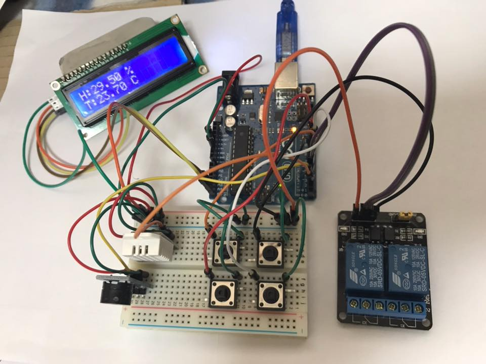

# TemperatureHumidityController
In the baking machine, temperature and humidity controller

The analog thermostat of the spherical fermenter is not controlled properly, making it difficult to make bread. 
A program created during transformation into a digital controller based on Arduino.

제빵용 발효기 아두이노 온/습도 제어기 자작기

제빵을 가르쳐 주신 교수님께서 아날로그식 제어기로 작동되는 발효기를 주셨음. 
실제 사용해보니, 온도는 그럭저럭 맞는 것 같은데 습도가 전혀 맞지를 않았음. 작동만 시키면 90% 이상으로 습도가 올라가 버림.

가열장치 및 가습장치는 손대기 어렵겠지만, 제어기는 디지탈 방식으로 바꿀수 있을 듯 했음.
그래서 DHT-22 온습도 센서와 1602 LCD 판넬, 4개의 탭스위치 (온도 상/하, 습도 상/하), 가열기 및 가습기용 릴레이 2 개로 
아두이노 온습도 제어기를 만들었음.

프로그램 알고리즘

1) 500 ms 간격 LOOP - 버튼스위치 인지 간격 확인.

2) 온도 센싱
  2.1) (가열 목표값 + 보정상수) > 실제값 - 가열히터 OFF 면 ON [보정상수는 히터를 껏을 경우 잠열이 유지되는 시간]
  2.2) 위 값이 아니면 가열히터 ON 이면 OFF

3) NONE

4) 습도 센싱
  4.1) (가습 목표값 + 보정상수) > 실제값 - 가습히터 OFF 면 ON [보정상수는 히터를 껏을 경우 잠열이 유지되는 시간]
  4.2) 위 값이 아니면 가습히터 ON 이면 OFF
5) NONE

6) T1 버튼 센싱
  6.1) 가열목표값에 + 1

7) T2 버튼 센싱
  7.1) 가열목표값에 - 1

8) T1, T2 모드 전환 (보정상수)

9) H1 버튼 센싱
  8.1) 가습목표값에 + 1

10) H2 버튼 센싱
  9.1) 가습목표값에 - 1

11) H1, H2 모드 전환 (보정상수)

12) 온도 / 습도 / 온도목표 / 가습목표 / 온도보정상수 / 가습보정상수 / 가열히터 동작상태 / 가습히터 동작상태 출력

디스플레이 창
Temp: 28 / 30 (5) *
Humi: 75 / 80 (5) -

Fermenter for Baking Aduino / Humidity Controller

The professor who taught baking gave me a fermenter operated by an analog controller.
In actual use, the temperature seems to fit, but the humidity did not match at all. Humidity goes up to more than 90% when operated.

The heating and humidifying devices would be difficult to touch, but the controller seemed to be able to change them digitally.
So, DHT-22 temperature and humidity sensor, 1602 LCD panel, 4 tap switches (temperature up / down, humidity up / down), 2 relays for heater and humidifier
I made the Arduino temperature and humidity controller.

Program algorithm

1) 500 ms interval LOOP - Check button switch interval.

2) Temperature sensing
  2.1) (heating target value + correction constant)> Actual value - ON when heating heater is OFF [The correction constant is the time during which the latent heat is maintained when the heater is turned off]
  2.2) If it is not above value, if heater heater is ON, OFF
3) none

4) Humidity sensing
  4.1) (Humidification target value + correction constant)> Actual value - ON when humidification heater is OFF [Calibration constant is the time when latent heat is maintained when heater is turned off]
  4.2) If it is not above value, if humidification heater is ON, OFF
5) none

6) T1 Button Sensing
  6.1) Heating target value + 1

7) T2 button sensing
  7.1) Heating target value - 1

8) T1, T2 mode switching (correction constant)

9) H1 button sensing
  8.1) Humidification target value + 1

10) H2 Button Sensing
  9.1) Humidification target value - 1

11) H1, H2 mode switching (correction constant)

12) Temperature / humidity / temperature target / humidification target / temperature correction constant / humidification correction constant / heating heater operation status / humidification heater operation status output

Display window
Temp: 28/30 (5) *
Humi: 75/80 (5) -

